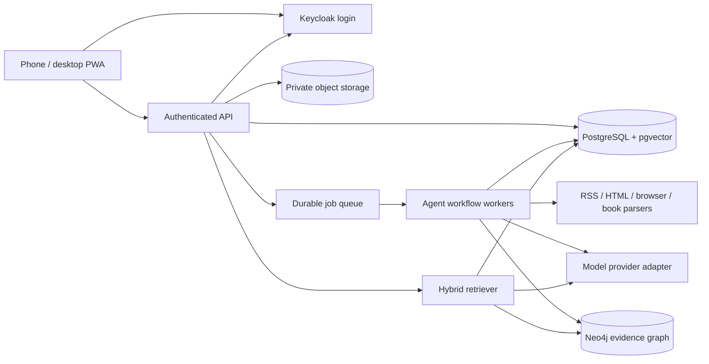

# Target architecture

The current implementation includes the landing page, Keycloak OpenID Connect login, a daily.dev-inspired feed, saved articles, an onsite book reader with reading progress, and private editable mindmaps. Java 25 / Spring Boot, Spring Security, JPA/Hibernate, PostgreSQL, and Flyway form the backend foundation. The evidence graph, book ingestion, and agents below are proposed future components. User-created mindmaps are not a GraphRAG index.

## Components and tradeoffs

| Component | Proposed implementation | Responsibility |
| --- | --- | --- |
| Client | React + TypeScript; add PWA support | Capture, read, annotate, graph exploration, study |
| API | Java 25 + Spring Boot + Spring Data JPA | Auth, workspace authorization, validation, signed file access |
| Record store | PostgreSQL | Sources, notes, versions, jobs, study progress, audit metadata |
| Vector search | pgvector | Chunk/entity embeddings and similarity retrieval |
| Graph | Neo4j | Typed concepts and evidence-backed relationships |
| Files | S3-compatible private object storage | Original files, normalized text, extraction artifacts |
| Workers | Java agent workflow runtime; implementation to be selected | Bounded research and learning workflows with checkpoints |
| Jobs | Durable queue with retries and idempotency | Imports, reindexing, scheduled discovery, deletion propagation |

Separate graph storage adds operational cost. Start with a lexical/vector baseline; add graph traversal only after an evaluation set demonstrates useful cross-source relationships. If the graph workload remains small, evaluate relational edge tables before committing to a second database. PostgreSQL is provisioned locally; graph storage and model providers are not configured yet.

## Data model

Current private records carry a `user_id` derived from the authenticated profile; shared demo books contain no private user data. Authorization is enforced before private reads and writes. Future collaborative records will use a `workspace_id` with membership checks. Never accept an owner ID from a model as authority. The following source and retrieval models remain planned.

- **Source:** type, title, author, canonical URL or private object key, rights/access basis, content hash, version, extraction coverage, timestamps.
- **Chunk:** source ID and version, stable locator (page/section/offset), text hash, normalized text, embedding model and version.
- **Entity:** canonical name, type, aliases, description, workspace; entity resolution decisions are inspectable.
- **Relationship:** subject, predicate, object, confidence, supporting chunk IDs; inferred relationships are distinguishable from explicit ones.
- **Note / highlight:** user-authored text, source locator, tags, revisions, linked entities.
- **Summary / answer:** claim blocks with citations, model/prompt version, retrieval snapshot, coverage, uncertainty.
- **Study plan / card / review:** objective, prerequisites, source citations, due date, user results.
- **Agent run:** state, attempts, budget, selected tools, immutable input references, output IDs, errors.

The capture model should preserve stable IDs and timestamps and separate user notes from extracted source content. It will be introduced with the reading-library milestone.

## Ingestion

1. Validate the URL/file, determine access and extraction support, and compute an idempotency key.
2. Fetch or parse in an isolated worker with size, duration, redirect, and resource limits.
3. Normalize text while preserving source location and distinguishing boilerplate from content.
4. Chunk with overlap and page/section anchors; embed with a versioned provider adapter.
5. Extract entities and typed relationships, attaching evidence to every edge; resolve aliases conservatively.
6. Commit a new source version and its index state atomically where possible; mark derived artifacts ready only after validation.
7. Generate summaries and study suggestions from the indexed evidence. Retry only failed stages.

## GraphRAG retrieval

1. Authorize the workspace and resolve the question's scope.
2. Combine keyword and embedding search to find relevant chunks and entity seeds.
3. Expand a bounded graph neighborhood, retaining only relationships with evidence in accessible sources.
4. Rerank and deduplicate the combined passages; enforce a context budget and preserve locators.
5. Generate an answer using only the selected evidence and distinguish source claims from synthesis.
6. Check that citations resolve and support claims. Abstain or qualify when coverage is insufficient.

Later, build versioned community summaries for broad questions spanning the library. Evaluate local search before enabling expensive global summarization. Microsoft's [GraphRAG query documentation](https://microsoft.github.io/graphrag/query/overview/) distinguishes entity-focused local retrieval from community-report-based global retrieval; this project uses that distinction as a design reference, not a claim that the library is already integrated.

## Multi-agent execution

Use a typed state graph and bounded specialist steps, with durable checkpoints, cancellation, and per-run budgets. Select a Java-compatible orchestration implementation in the agent milestone; model choice and retrieval policy remain application responsibilities. See [agent contracts](agents.md).

## Content and execution boundaries

- Prefer feeds and publisher APIs; use HTML extraction before browser rendering. Proposed adapters: RSS/Atom parser, HTTP + Trafilatura, isolated Playwright, PDF/EPUB parser, and approved book metadata catalogs.
- Follow configured source access rules and rate limits. Import full books only from user-provided, licensed, or public-domain material; metadata discovery is not permission to retrieve a full book.
- Block localhost, private/reserved IPs, cloud metadata addresses, and unsupported URL schemes on every network request and redirect; pin validated DNS results to prevent rebinding. Apply egress controls to browser subresources too.
- Treat source text as untrusted data. It cannot grant tool permissions, reveal secrets, run code, or change the task.
- Keep secrets on the server, restrict object access, and prevent private excerpts from entering public logs.
- A public client bundle may never contain source uploads, personal exports, or privileged API credentials.

## Sync and evaluation

Use versioned writes and a conflict record instead of silently overwriting offline edits. Browser storage becomes an explicitly managed cache after authentication and sync are implemented. Test multi-device edits, retry races, deletion propagation, and account isolation.

Maintain a small licensed evaluation corpus with annotated questions, required evidence, and unanswerable cases. Track retrieval recall, citation support, unsupported claims, latency, cost, and incremental indexing correctness. Compare graph retrieval with the baseline before broad deployment.
